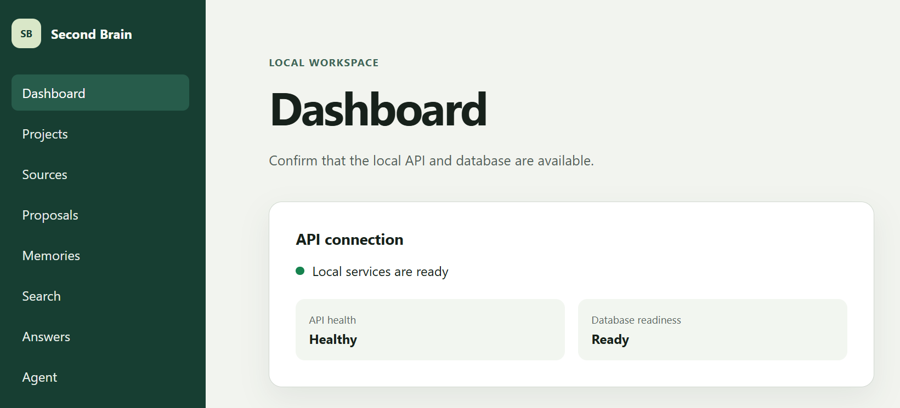
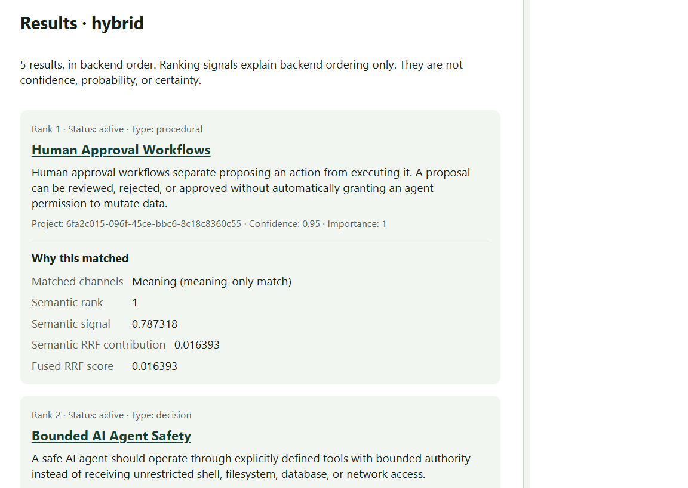
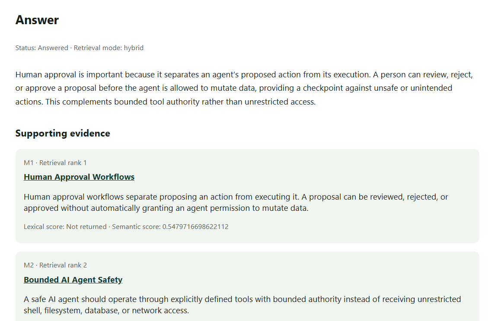
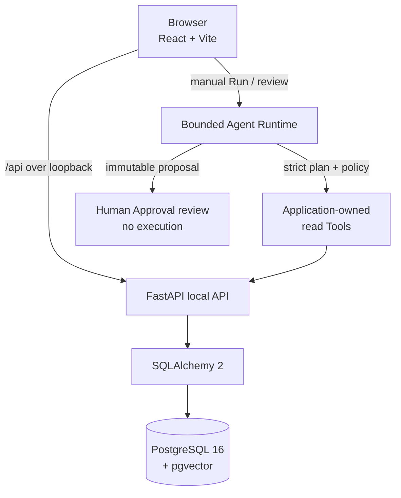

# Second Brain

**A local-first personal knowledge system for turning source material into reviewed, searchable, evidence-backed knowledge.**

[](https://github.com/DarkAxiom93/Second_Brain/releases/tag/v1.2.1)
[](https://github.com/DarkAxiom93/Second_Brain/actions/workflows/ci.yml)
[](https://www.python.org/)
[](https://fastapi.tiangolo.com/)
[](https://react.dev/)
[](https://github.com/pgvector/pgvector)

Second Brain is a local-first personal knowledge management application. It combines structured **Memories**, source-backed retrieval, evidence-backed **Answers**, and bounded **AI Agents** in a loopback-only workspace for one trusted maintainer. The result is a practical knowledge base with semantic search and RAG-style retrieval—without handing a model unrestricted control of your computer.

[**V1.2.1 release**](https://github.com/DarkAxiom93/Second_Brain/releases/tag/v1.2.1) · [**Local runbook**](docs/LOCAL_V1_RUNBOOK.md) · [**Architecture**](docs/ARCHITECTURE.md) · [**Known limitations**](docs/KNOWN_LIMITATIONS.md)

<p align="center">
  
</p>

## What you can do

The core workflow keeps source material, model suggestions, reviewed knowledge, and agent activity visibly separate.

| Area | Current V1.3 candidate capabilities |
| --- | --- |
| Organize | Group knowledge into Projects and maintain structured, provenance-linked Memories. |
| Ingest | Create Sources and ingest TXT, PDF, or JSON content into auditable documents and chunks. |
| Review | Generate source-backed Memory proposals, inspect their evidence, approve or reject them, then promote approved proposals explicitly. |
| Retrieve | Search active Memories with lexical, semantic, or hybrid retrieval; explained search shows deterministic channel ranks and signals. |
| Answer | Ask stateless questions over bounded Memory retrieval and receive evidence-backed Answers with citations. |
| Move data | Export a Project to a private versioned bundle, validate an import without writing, and execute only conflict-free imports. |
| Use Agents | Manually run bounded plans, use a read-only Research Agent, review advisory Memory Curator proposals, and inspect explicit Approvals. |
| Automate | Define one-time, daily, or weekly Automations for fixed Daily Brief and Project Watch Agents, using safe `create_only` or explicit `automatic_read_only` execution. |

Second Brain also includes explicit Memory supersession, expiration, quality refinement, embedding maintenance, local diagnostics, and maintenance audits. Provider-backed features require locally configured credentials; lexical search and the rest of the deterministic application remain available without them.

## See it in action

### Explained hybrid search

Lexical and semantic retrieval can be combined through hybrid search. Per-channel ranks, signals, and Reciprocal Rank Fusion contributions show why the backend ordered each result.

<p align="center">
  
</p>

### Evidence-backed answers

Answers retrieve a bounded set of Memory evidence and render supporting citations alongside the generated response. The workflow is stateless: questions, answers, citations, and retrieval history are not persisted.

<p align="center">
  
</p>

## Agents and Automations: safety by design

Second Brain treats model output and retrieved content as untrusted data. Agents do not receive a terminal, a browser, database access, or a general-purpose tool interface. Instead, every Run passes through application-owned policy, a versioned tool registry, strict schemas, bounded plans, and durable audit state.

- Manual Agents remain explicitly initiated. A separate operator-started scheduler may trigger only the fixed `daily_brief` v1 and `project_watch` v1 Agents.
- Automations default to `create_only`; `automatic_read_only` is an explicit opt-in and cannot grant write, propose, or Approval authority.
- The Research Agent is read-only and can use only scoped, application-owned read Tools.
- The Memory Curator is advisory and can create only immutable `memory.update` proposals.
- A human explicitly approves or rejects proposed actions; V1.2 cannot execute a proposal.
- Agents cannot write autonomously or run arbitrary shell, Python, SQL, filesystem, browser, or network operations.
- There are no external research services, connectors, external writes, or hidden cloud services.
- The supported deployment remains loopback-only for one trusted maintainer, with no remote or multi-user trust boundary.

These are deliberate authority limits, not accidental gaps: the model cannot grant itself new tools or permissions. See the [Agent threat model](docs/AGENT_THREAT_MODEL.md) for the trust boundaries, invariants, and deterministic security gates.

## Architecture

The application is deliberately compact: a React/Vite browser client talks to a loopback FastAPI API, which persists data through synchronous SQLAlchemy sessions in PostgreSQL 16 with pgvector. The bounded Agent Runtime lives inside the application boundary and can invoke only allowlisted application reads.



There is no authentication or cloud boundary. Keep Vite, FastAPI, and PostgreSQL bound to their documented loopback addresses.

## Quick start on Windows

Prerequisites: CPython 3.12, Node.js 22.12+ with npm 10+, Docker Desktop using Linux containers and Compose v2, Git, and Windows PowerShell 5.1+.

```powershell
git clone https://github.com/DarkAxiom93/Second_Brain.git
Set-Location Second_Brain

& 'C:\path\to\Python312\python.exe' -m venv .venv
& '.\.venv\Scripts\python.exe' -m pip install -e '.[dev]'
& '.\.venv\Scripts\python.exe' -m pip check
.\scripts\frontend-setup.ps1

.\scripts\dev-up.ps1
.\scripts\verify-databases.ps1
& '.\.venv\Scripts\python.exe' -m alembic current
& '.\.venv\Scripts\python.exe' -m alembic heads
& '.\.venv\Scripts\python.exe' -m alembic check
```

The development database must resolve both in configuration and live as `127.0.0.1:5433/second_brain`; the separate test database must be `second_brain_test`. The sole migration head is `0011_automation_persistence`. Never downgrade the development database or delete its named volume.

Then open two additional PowerShell terminals at the repository root:

```powershell
# Terminal 2
.\scripts\start-api.ps1
```

```powershell
# Terminal 3
.\scripts\frontend-dev.ps1
```

Open <http://127.0.0.1:5173>. The complete safe setup, migration verification, backup, shutdown, troubleshooting, and recovery procedures are in the [local runbook](docs/LOCAL_V1_RUNBOOK.md).

To run one explicit bounded Automation scheduler tick:

```powershell
.\scripts\run-automation-scheduler.ps1
```

The command materializes and claims bounded due work, creates or reuses at most
one Agent Run per occurrence, reconciles committed state, and coordinates only
explicit `automatic_read_only` Daily Brief or Project Watch work. `create_only`
remains the default. The command is one operator-started tick and never runs from
API startup.

## Current release

### [v1.2.1 — Second Brain Local V1.2.1](https://github.com/DarkAxiom93/Second_Brain/releases/tag/v1.2.1)

V1.2.1 is the current patch release. It hardens live-provider Agent planning, Research and Curator synthesis, and long-running planning/execution UX while preserving the V1.2 safety and authority boundaries. V1.2.0 remains available as the preceding published release.

Release commit: [`04e9db33dc0de7529b1599871c58cace6ed9f9e2`](https://github.com/DarkAxiom93/Second_Brain/commit/04e9db33dc0de7529b1599871c58cace6ed9f9e2)

Read the [V1.2 release notes](docs/LOCAL_V1_2_RELEASE_NOTES.md) and [V1.2.1 hotfix report](docs/V1_2_1_HOTFIX_REPORT.md) for the detailed inventory, verification, and recovery guidance.

Local V1.3 is a release candidate only. See the [candidate V1.3 release notes](docs/LOCAL_V1_3_RELEASE_NOTES.md); no `v1.3.0` tag or GitHub Release has been created.

## Current limitations

- Second Brain is a trusted, single-maintainer local application with no authentication, remote access, synchronization, or multi-user isolation.
- Provider-backed proposal generation, embeddings, semantic/hybrid retrieval, and successful generated Answers require local provider credentials.
- Agents remain bounded. Automatic execution is limited to explicit opt-in fixed read-only Daily Brief and Project Watch definitions; there is no startup worker, connector, autonomous Approval, external write, or proposal execution.
- Answers are stateless; questions, answers, citations, and conversation history are not persisted.
- Project bundles are sensitive and unencrypted, exclude Agent and Approval state, and support validation-first, conflict-free import only—never merge or overwrite.
- Maintenance is explicit and advisory; there is no automatic repair, expiration processing, or re-embedding.

See [Known limitations](docs/KNOWN_LIMITATIONS.md) for the complete, candid boundary list.

## Documentation

| Guide | What it covers |
| --- | --- |
| [Local runbook](docs/LOCAL_V1_RUNBOOK.md) | Supported Windows setup, verification, backup, shutdown, and recovery. |
| [Architecture](docs/ARCHITECTURE.md) | System topology, components, persistence, boundaries, and transactions. |
| [V1.2 release notes](docs/LOCAL_V1_2_RELEASE_NOTES.md) | Release inventory, safety boundary, and recovery notes. |
| [V1.3 candidate release notes](docs/LOCAL_V1_3_RELEASE_NOTES.md) | Candidate Automation inventory, verification, recovery, and deferred scope. |
| [Known limitations](docs/KNOWN_LIMITATIONS.md) | Current operational and product boundaries. |
| [Agent threat model](docs/AGENT_THREAT_MODEL.md) | Assets, trust boundaries, security invariants, and threat controls. |
| [Verification](docs/VERIFICATION.md) | Local verification requirements and release-authoritative checks. |
| [API conventions](docs/API_CONVENTIONS.md) | Public contract, transaction, privacy, and Agent API rules. |
| [Checkpoint history](docs/CHECKPOINTS.md) | Detailed implementation history for maintainers. |

## Project status

Second Brain Local V1.2.1 is published and remains intentionally local-first. Issues, feedback, and stars are welcome. The repository does not currently define a formal contribution process; review the architecture, safety rules, and checkpoint guidance before proposing changes.

For release-authoritative local verification, keep PostgreSQL and the separate test database running, then run:

```powershell
.\scripts\verify.ps1 -Mode Full
```

This checks database identities, Python dependencies, Ruff, mypy, the complete pytest suite, Alembic state, frontend lint/typecheck/tests/build, and `git diff --check`.
