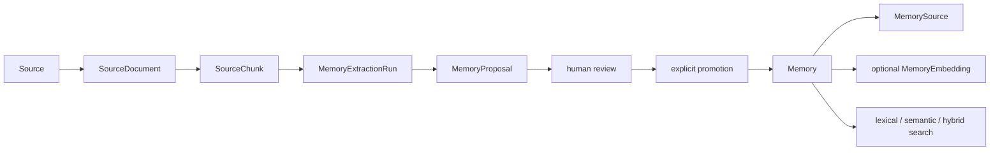

# Architecture

Second Brain is a local, Windows-hosted FastAPI application. PostgreSQL 16 with
pgvector runs in Docker Compose. Application persistence uses synchronous
SQLAlchemy 2 sessions and Alembic migrations; the current head is
`0008_memory_proposals`.

## Components and data

- `Project` groups Memories and proposal work.
- `Memory` is the reviewed knowledge record. `Source` and `MemorySource` provide
  normalized provenance links.
- `MemoryEmbedding` stores the optional current provider/model embedding outside
  `Memory`.
- `SourceDocument` stores TXT/PDF ingestion metadata and extracted text;
  `SourceChunk` stores ordered evidence ranges.
- `MemoryExtractionRun` records a deterministic AI extraction attempt;
  `MemoryProposal` stores immutable evidence snapshots and review state.
- Memory retrieval supports lexical PostgreSQL text search, semantic pgvector
  search, and hybrid Reciprocal Rank Fusion (RRF).
- AI generation produces proposals. Human approval and explicit promotion are
  separate actions; only promotion creates a `Memory` and `MemorySource`.

## Boundaries and transactions

Persistence models define database shape and relationships. Repositories own
SQL-side filtering, locking, ordering, ranking, and persistence operations, but
never commit. Typed FastAPI routes validate public input, map expected failures,
own commit/rollback, and shape public responses. Provider integrations isolate
paid/external embedding and extraction calls. Ingestion and extraction helpers
that parse, normalize, chunk, hash, or validate data remain pure where possible.
The caller that owns the SQLAlchemy session owns the transaction.
