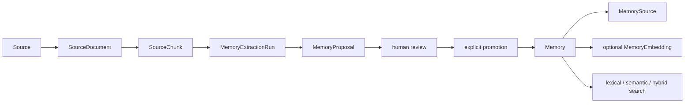

# Architecture

Second Brain is a local, Windows-hosted FastAPI application. PostgreSQL 16 with
pgvector runs in Docker Compose. Application persistence uses synchronous
SQLAlchemy 2 sessions and Alembic migrations; the current head is
`0014_connector_refresh_schedules`.

Local V1 operation is defined by `LOCAL_V1_RUNBOOK.md`, with capability evidence
in `LOCAL_V1_ACCEPTANCE.md` and explicit deferrals in `KNOWN_LIMITATIONS.md`.
The stable recovery architecture is released as `v1.0.0` at commit
`a1bf40c0a27e9ee508e9bf1ab151b4665fbdba32`. The supported release topology
remains loopback Vite and FastAPI plus the named-volume PostgreSQL service;
there is no authentication or cloud boundary. All nine top-level UI routes are
functional. Local V1.1 is published as `v1.1.0` from exact commit
`88dffa90ff04cde4c57dcacbe2764b8a31b0c9ce`; `v1.0.0` remains the pre-V1.1
recovery point.

The additive V1.1 architecture is documented in
[V1_1_ROADMAP.md](V1_1_ROADMAP.md). It preserves this topology and data model,
isolates dependency remediation and non-authoritative CI, then adds one
read-only explained-search contract and its accessible UI. Checkpoint 57 is
complete at `f6b9260`; Checkpoint 58 consumes `POST /memories/search/explained`
locally. Checkpoint 59 is committed at `42fdfc8`; Checkpoint 60 is complete at
the V1.1 release commit. Existing
search responses and version-1 export/import remain compatible. No V1.1
migration is proposed.

Checkpoint 61 completed the documentation-only Local V1.2 Agent architecture at
`850cfd0a749b5de072b910203ba9906ab5270b40`. Checkpoint 62 completed the durable
five-table persistence foundation at
`3da0cdd875dc8af7a60fd8af5b6f9878be5a769a`. Checkpoint 63 completed the manually
initiated Agent Run create/retrieve/list/cancel API and strict internal state
transition service at `01832a94ae6f80bdacd0cd9301af3f294302e3e8`.
Repositories accept caller-owned
synchronous sessions and never commit. AgentRun row locks serialize revision and
event-sequence allocation, and child ownership derives scope from the Run.
Version-1 Project export/import excludes these tables. Checkpoint 64 completed
the immutable code-owned `agent-tools-v1` registry and pure fail-closed policy
resolver at `35950c60fd842a4ad022f130a3074ce8d21d9bbc`. Checkpoint 65 completed
strict structured planning at `1b32d91e62feb10efd5c2f2c241ee43b75b5b5e2`.
Checkpoint 66 completed synchronous ordered execution through exactly five
scoped application-owned reads at
`d4a3533282a8ed616fa0910fcea99b07b0f1b878`. Checkpoint 67 completed a closed retry
classifier, at most one global safe-read retry, terminal execution replay,
deadline/cancellation reconciliation, stale detection, and one explicit
synchronous operator recovery command at
`7b6c6bb8c4c67f9e8a5a34c363331bc94dbb094e`. Recovery is
never automatic; there is no worker, scheduler, lease, heartbeat, or startup
recovery. The architecture is in
[V1_2_AGENT_ROADMAP.md](V1_2_AGENT_ROADMAP.md) and
[AGENT_THREAT_MODEL.md](AGENT_THREAT_MODEL.md). The existing four Agent Run
operations remain unchanged, with two additive plan operations at
`POST /agent-runs/{run_id}/plan` and `GET /agent-runs/{run_id}/plan`. Planning
commits its claim before provider latency and validates the whole result before
atomically freezing pending Steps with `ready`. There is no generic transition
or child-entity API. Execution is exposed only at
`POST /agent-runs/{run_id}/execute` with its bounded projection at
`GET /agent-runs/{run_id}/execution`. Checkpoint 69 adds the explicit-refresh-only
Agent Runs UI at `/agents` and `/agents/:runId`; there is no approval execution,
Automation, connector, or external behavior. The registry contains exactly
seven version-1 read-only metadata definitions: `project.get`, `memory.get`,
`memory.search_explained`, `source.get`, `source_chunk.get`,
`operations.diagnostics`, and `maintenance.audit`. New Runs capture
`agent-tools-v1`; existing Runs retain their captured value. Only the first five
entity/search reads are executable by Runs; both operator aggregates remain
denied. Execution revalidates policy before each reservation, releases all Run
locks across Tool latency, and persists only safe summaries and evidence
references. The boundary
separates a manually initiated durable Agent Run from a future Automation that
would trigger a Run. Initial authority is read-only: models cannot grant
authority, tools are code-owned/versioned/schema-bounded, proposals require
exact immutable human review, and execute authority is unavailable. Schedulers,
workers, connectors, external writes, arbitrary execution, and remote or
multi-user operation remain outside V1.2.

Checkpoint 70 adds the immutable `research` version `1` Agent with `read`
authority and exactly the first five entity/search Tools. Retrieved content is
untrusted evidence, never instruction. Synthesis may cite only application-
supplied evidence IDs; exact Run/Step/Invocation ownership, nullable scope,
existence, and deterministic current entity version are revalidated before one
safe result event commits. Memory versions reuse the Checkpoint 68 target-version
helper. Empty evidence returns explicit insufficiency without provider
resolution. Research has no proposal, Approval creation, execute authority,
mutation, operator aggregate, external research, browser, or HTTP capability.

Checkpoint 71 adds one immutable `memory_curator` version `1` Agent with maximum
authority `propose`. It uses only `memory.get` and `memory.search_explained`
version 1 from the unchanged `agent-tools-v1` registry. Strict synthesis may
persist bounded cited findings and create only immutable `memory.update`
Approval Requests through the Checkpoint 68 foundation. Application code
derives all target, version, identity, risk, expiry, scope, and status fields;
neither the Run nor Approval review mutates a Memory or executes an action.

Checkpoint 72 is complete at
`45e940ec89b6cf3783ab2dc7cdfa837b6cbc3597`. It adds an executable T01-T24
security traceability gate and a
PostgreSQL-serialized maximum of 32 nonterminal Agent Runs. Capacity includes
`created`, `planning`, `ready`, `running`, and `awaiting_approval`; exact
idempotent replay is resolved first, terminal Runs release capacity, and a full
system rejects creation with a safe response. No queue, scheduler, worker, new
authority, migration, or Agent capability is introduced.

Checkpoint 73 local V1.2 end-to-end acceptance is complete at
`26c74cced438fd850907d593db5090719f6e861a`. Its accepted evidence is recorded
in `checkpoint-73-report.md`. Checkpoint 74 release hardening is complete at
`53d78f30c7e9ff4020179c57e286ad24980df6af` after human approval and successful
push CI run `32474664878` with zero artifacts. V1.2.0 remains intact as the
preceding published release from
`67e790f2f2c34b346773cddba385fa3f2db04a26`. V1.2.1 is the current published
patch release from `04e9db33dc0de7529b1599871c58cace6ed9f9e2`, with final
successful pre-release CI run `32559057246`. Its live-provider planning,
Research and Curator synthesis, and long-running frontend reliability hardening
preserve the existing authority boundary. V1.3 work remains additive and does
not alter the published V1.2.1 recovery boundary.

Checkpoint 75 completed the approved Local V1.3 architecture in
[V1_3_AUTOMATION_ROADMAP.md](V1_3_AUTOMATION_ROADMAP.md) and
[V1_3_AUTOMATION_THREAT_MODEL.md](V1_3_AUTOMATION_THREAT_MODEL.md). The minimal
planned model separates durable Automation definitions from immutable trigger
occurrences, local notification records, and existing bounded Agent Runs. It
uses typed schedules, unique occurrence identities, fenced leases, deterministic
UTC/IANA-timezone handling, and fixed read-only Daily Brief and Project Watch
Agents. Checkpoint 76 now adds only the inert three-table Automation persistence
foundation and caller-transaction-owned repository primitives. It adds no
scheduler, API, UI, Agent, registry, or authority change. Checkpoint 76 is
approved and complete after human review.

Checkpoint 77 adds the typed loopback Automation definition and lifecycle API,
closed code-owned schedulable catalog boundary, deterministic one-time/daily/
weekly UTC and IANA-timezone calculator, and calculation-only bounded preview.
Automation row locks and revision compare-and-set serialize edits and lifecycle
transitions. This checkpoint adds no migration, occurrence materialization,
scheduler, worker, Agent Run creation, provider/Tool call, UI, or execution
authority. Checkpoint 77 is approved and complete after human review.

The pre-Checkpoint 78 architecture remediation reserves every version of the
`daily_brief` and `project_watch` Agent-kind families until an exact version has
an explicitly installed fixed definition and dedicated Tool allowlist. Public
manual Run creation rejects reserved identities, while planning, execution, and
explicit recovery reject persisted reserved Runs before granting work. Internal
transaction-neutral Run creation remains available for future atomic scheduler
linking, but such Runs stay inert until a later fixed Agent-definition
checkpoint explicitly activates them.

Checkpoint 78 is approved and complete after human review. An explicit
operator-started one-tick command materializes at most 16 enabled due
Automations using deterministic `FOR UPDATE SKIP LOCKED`, advances each schedule
from its prior slot in the same transaction, claims bounded `create_only`
occurrences with opaque 60-second generation-fenced leases, and atomically
creates/links one capacity-checked Agent Run per occurrence. Runs remain
`created`; the reserved Agent gates prevent planning, execution, recovery,
provider, and Tool work. The scheduler is absent from FastAPI startup and does
not perform Agent planning or execution.

Checkpoint 79 is approved and complete after human review. Each explicit bounded
scheduler tick now uses PostgreSQL UTC time, reconciles exact linked Runs,
generation-fences only expired claims, and applies closed `skip`/`run_once`
catch-up without replay-all. Safe pre-link database setup failures reuse the
same occurrence with at most three attempts and deterministic capped backoff;
capacity deferral consumes no failure attempt. Ambiguous outcomes and exhausted
retries become content-free durable operator-visible failures. Linked Runs are
never replaced and the scheduler still performs no Agent planning, execution,
provider, Tool, or manual Agent recovery operation.

Checkpoint 80 is approved and complete after human review. It adds a reusable
automatic-read-only coordinator over the existing durable Agent Run planning
and execution services plus an explicit revision-aware execution-mode action.
Eligibility requires an exact fixed code-owned read definition, current
registry/policy/scope identity, and the one linked Run; short validation and
reconciliation transactions bracket all provider and Tool latency. Production
eligibility remains deliberately empty, so `daily_brief` and `project_watch`
remain reserved and ordinary ticks perform no automatic provider or Tool work.

Checkpoint 81 is approved and complete after human review. It adds bounded safe
occurrence-history and local notification-inbox APIs plus the accessible
Automations list, draft creation, detail/edit, lifecycle, schedule preview,
history, linked-Run navigation, and notification inbox UI. Mutations remain
revision-aware with explicit authoritative refresh after conflict. Notifications
are content-free local records with atomic idempotent mark-read; there is no
polling, browser persistence, service worker, OS notification, or external
delivery. Production automatic eligibility remains empty and no fixed Agent is
installed.

Checkpoint 82 implements the scheduled-only `daily_brief` version `1` Agent as
the sole production Automation Agent identity. Its fixed label-free goal,
read-only five-Tool allowlist, exact nullable Project scope, versioned evidence,
bounded cited synthesis, safe Run projection, and content-free successful-run
notification reuse the existing Agent Runtime and Checkpoint 80 coordinator.
Its Daily Brief-specific application-event projection reads at most five recent
terminal `AutomationOccurrence` records in the exact nullable Project scope and
exposes only a code-owned event kind, occurrence UUID/version, terminal and
scheduled timestamps, and fixed Agent identity. Labels, raw Agent events,
notifications, leases, keys, provider/Tool content, prompts, and mutation data
remain unavailable. `project_watch` remains reserved and unimplemented.
Checkpoint 82 is approved and complete after human review.

Checkpoint 83 implements scheduled-only `project_watch` version `1` as the
second and only other production Automation Agent identity. It requires one
exact non-null Project and uses a fixed label-free goal, the existing five read
Tools, and a closed Project/Memory change projection. The application derives
the deterministic `(lower, upper]` window from durable Automation occurrence
facts: the current canonical scheduled instant is the upper bound, and the
lower bound is the prior successfully completed Project Watch occurrence's
scheduled instant or a bounded seven-day first-run value. Only a completed
linked Run with a persisted Project Watch result advances the predecessor.
Results are bounded cited `changes_found` findings or a durable
`no_meaningful_change`. Checkpoint 83 is approved and complete after human
review.

Checkpoint 84 is approved and complete after human review. Its deterministic
A01-A18 manifest, adversarial corpus, PostgreSQL concurrency/fault gates,
notification privacy checks, and complete-row protected-domain snapshots add
release evidence without changing production behavior. Checkpoint 85 is also
approved and complete: its joined acceptance proves both fixed Agents through
the loopback API, scheduler, Agent Runtime, history, notification, and UI
contracts without duplicate occurrences or Runs. Checkpoint 86 is
documentation-and-evidence-only release hardening for candidate `v1.3.0`; no
tag or GitHub Release has been created.

Checkpoint 91 implements one explicit synchronous manual GitHub refresh for an
enabled, revision-matched ConnectorAccount. The production transport is fixed to
GET requests against `https://api.github.com` for authenticated-user identity,
exact configured repository metadata, issues, and pull requests only. Claims
commit before credential or network latency, PostgreSQL advisory locking
serializes the global active-sync cap of four, and every validated page commits
quarantined ExternalItem revisions in a short fenced transaction. No connector
content is available to Agents or Automations, no deletion inference or import
exists, and Tool Registry/export identities remain unchanged.

Checkpoint 92 adds account-and-exact-scope-bound browsing of only the latest
quarantined ExternalItem revision, with explicit bounded history reads, closed
type/state filters, opaque filter-bound keyset cursors, typed normalized public
content, and application-derived canonical GitHub links. A fully exhausted
manual refresh reconciles only latest exact identities in its captured scope:
observed identities are current and absent identities become stale. Incomplete
or failed runs infer no absence. There is no deletion, import, Agent/Automation
access, transport expansion, or migration.

Checkpoint 93 adds one explicit, network-free preview/confirm action that copies
exactly one current latest ExternalItem revision into the audited local
Source/SourceDocument/plain-text chunk boundary. The additive
`external_item_imports` relationship permanently binds the exact quarantined
revision to its resulting document; database uniqueness and an ExternalItem row
lock provide revision-specific idempotency. Disabled or revoked accounts retain
this historical import capability because no credential or provider access is
performed. Import creates no Memory, proposal, Approval, Agent, or Automation
state, and connector provenance remains excluded from Project export v1.

Checkpoint 68 is complete at
`1bc90b4339bd5466fda10e5d04711e3f025a0e01`. Its four additive Approval APIs create,
list, retrieve, and human-review immutable `memory.update` proposals using the
existing CP62 persistence. Creation derives the exact scoped target version,
canonical payload hash, bounded preview/evidence/risk, expiry, and execution
identity server-side. Review serializes Approval, Run, and target locks; expiry
becomes `expired`, target or scope drift becomes `superseded`, and exact
same-decision replay is write-free. Approval never changes a Memory, invokes a
Tool, transitions a Run, consumes the frozen execution identity, or grants
write/execute authority.

The Checkpoint 56 CI workflow is an early regression signal on pull requests to
`main`, pushes to `main`, and manual dispatch. Its Windows runner performs the
established non-database Quick path and locked frontend checks without secrets,
write permission, PostgreSQL, Docker, artifacts, publishing, or deployment.
It does not replace the release-authoritative local
`.\scripts\verify.ps1 -Mode Full` workflow or its database and acceptance gates.

A client-only React and TypeScript application lives in `frontend/`. Vite serves
the local development UI and proxies `/api/*` to the existing loopback FastAPI
routes after removing `/api`. The browser uses same-origin relative requests by
default, so the backend requires no CORS changes. The initial dashboard reads
only `/health` and `/ready`. Projects uses the existing paginated list and
creation contracts plus read-only single-Project retrieval; its routes provide
list, creation, and detail screens. Sources uses paginated list and creation
contracts, read-only single-Source retrieval, and the existing Source-to-Memory
relationship listing for safe provenance detail. Source detail also lists its
persisted document, links to explicit JSON/TXT/PDF ingestion, and provides a
read-only paginated chunk browser. Proposals provides explicit SourceDocument-triggered
generation, a filtered paginated review queue, evidence/provenance detail, human
approval or rejection, and separate explicit promotion. Memories provides
persisted-field filtering and pagination, safe detail provenance, explicit
quality/supersession/expiration actions, and read-only quality advisories.
Search provides explicit lexical, semantic, and hybrid retrieval through the
additive explained-search contract, preserves backend ordering and global ranks,
and presents validated channel signals as ordering aids. Answers provides an
explicit stateless question workflow through the existing answer contract,
preserves returned citation order, and links returned public Memory IDs without
follow-up requests. Settings is a local operations dashboard over
health, readiness, safe diagnostics, aggregate maintenance findings, and
embedding coverage. It also provides explicit, loopback-only version-1 Project
export, import validation, and conflict-free import execution. Bundles stream
through exact temporary files; validation remains read-only and execution owns
one atomic commit. It exposes no repair, migration, or embedding control.
The frontend has no authentication, persistent browser storage,
service worker, or provider integration.

## Components and data

- `Project` groups Memories and proposal work.
- `Memory` is the reviewed knowledge record. `Source` and `MemorySource` provide
  normalized provenance links.
- `MemoryEmbedding` stores the optional current provider/model embedding outside
  `Memory`.
- `SourceDocument` stores TXT/PDF ingestion metadata and extracted text;
  `SourceChunk` stores ordered evidence ranges.
- `MemoryExtractionRun` records a deterministic AI extraction attempt;
  `MemoryProposal` stores immutable evidence snapshots and review state.
- Memory retrieval supports lexical PostgreSQL text search, semantic pgvector
  search, and hybrid Reciprocal Rank Fusion (RRF).
- The additive explained-search projection exposes only one-based global result
  and channel ranks, six-decimal bounded lexical/semantic signals, and hybrid
  RRF contributions with `k=60`. Ranking, filtering, fusion, ordering, and
  pagination remain in one bounded SQL statement. Lexical mode never resolves
  an embedding provider; semantic and hybrid modes preserve existing safe
  provider behavior. Queries, embeddings, results, and history are not stored.
- Evidence-backed answers are stateless, read-only operations over one bounded
  active-Memory retrieval. A strict answer provider may cite only deterministic
  evidence labels; questions, answers, prompts, and retrieval history are not
  persisted.
- Memory quality detection performs advisory, read-only exact and similar
  candidate classification within one project. It may read existing embeddings
  only when provider, model, and dimensions match, but never generates them or
  modifies a Memory. Exact equality is queried independently; advisory similar
  discovery uses bounded relevance-ranked lexical and semantic pools.
- Contradiction detection reuses those same scoped, bounded candidate pools and
  reports only deterministic English explicit-negation or opposing-boolean-state
  pairs whose remaining normalized proposition anchors match exactly. It is
  advisory, non-exhaustive, provider-free, and never persists its results.
- Memory supersession is an explicit human action between two existing active
  Memories in equal nullable project scope. It preserves provenance and content,
  supports acyclic predecessor chains, and atomically marks only the older row
  superseded while linking the active replacement. Deterministic row locking
  enforces one direct successor and idempotent concurrency without automatic
  contradiction resolution.
- Memory expiration is an explicit human action on one active Memory. A row lock
  makes the active-to-expired transition idempotent under concurrency; the
  operation preserves an existing past expiration timestamp and replaces a null
  or future timestamp with the request's captured UTC time. No scheduler changes
  status merely because `expires_at` passes.
- Memory quality refinement is an explicit human action on one active Memory.
  A row lock serializes partial or complete confidence/importance updates;
  equal requests write nothing. No provider, automatic scoring, or retrieval
  ranking policy participates.
- Batch Memory embedding generation is an explicit synchronous action over at
  most 50 active Memories that lack embeddings. Project, unassigned, and all
  scopes select deterministically by creation time and UUID. One ordered
  provider request is validated before deterministic row locks recheck status
  and existing embeddings; successful inserts commit atomically, concurrent
  winners remain unchanged, and newly inactive rows are skipped. Empty batches
  resolve no provider. Existing embeddings are never replaced, and no
  background generation or re-embedding occurs.
- Batch Memory re-embedding is a separate explicit synchronous action over at
  most 50 active Memories that already have embeddings. Stale selection compares
  the canonical input hash and configured provider, model, and dimensions;
  forced-all selection replaces every eligible in-scope row. SQL selects in
  creation-time and UUID order, one validated provider batch runs without row
  locks, and deterministic locks then recheck eligibility before atomic in-place
  replacement. Embedding identity and creation time are preserved. Missing
  embeddings are never created, and no scheduled or background re-embedding
  occurs.
- Memory maintenance auditing is a developer-only, point-in-time, read-only
  operation. It captures one UTC instant, aggregates status/project assignment,
  and reports bounded creation-time/UUID-ordered IDs for missing or stale active
  embeddings, due/future active expiration timestamps, inconsistent expired
  state, and non-active embeddings. Staleness reuses the controlled
  re-embedding SQL predicate. Parsed/live database identity and a database
  read-only transaction prevent accidental writes; no provider is resolved.
- AI generation produces proposals. Human approval and explicit promotion are
  separate actions; only promotion creates a `Memory` and `MemorySource`.
- Project export is an explicit maintainer-only, read-only operation. It streams
  one project-scoped graph from a repeatable-read PostgreSQL snapshot into the
  checksummed `second-brain-project-export` version 1 private bundle.
- Project import is an explicit maintainer-only operation. It validates a
  complete version-1 bundle and target conflicts before dependency-safe inserts
  in one transaction. Validation-only is read-only; restore never merges,
  overwrites, remaps, repairs, or calls a provider.
- Operational diagnostics are an explicit local, read-only command. One captured
  UTC instant covers runtime/configuration identity, PostgreSQL and pgvector,
  Alembic consistency, required tables, and safe aggregate counts. Provider
  configuration is inspected without resolution or network calls; optional API
  probes are restricted to credential-free loopback targets.
- `GET /operations/diagnostics` reuses the established configuration, PostgreSQL,
  pgvector, Alembic, required-table, and aggregate-count checks inside the request
  session's database-enforced read-only transaction. Its public contract removes
  the target database and all diagnostic metadata; each check exposes only its
  ID, category, status, and safe message.
- `GET /operations/maintenance-audit` reuses the established audit with a zero
  detail limit and exposes aggregate status and finding counts only. Memory UUID
  samples and truncation details remain private. The underlying audit has no
  Project-scoped contract, so the route accepts no Project filter.
- `POST /operations/project-exports/{project_id}` streams the established
  deterministic bundle as a private attachment. `POST
  /operations/project-imports/validate` and `/execute` accept bounded raw bundle
  bodies. All three require the direct loopback client and a distinct exact
  operation header, ignore forwarded-client headers, return `no-store`, and
  remove only their request-owned temporary file.

## Boundaries and transactions

Persistence models define database shape and relationships. Repositories own
SQL-side filtering, locking, ordering, ranking, and persistence operations, but
never commit. Typed FastAPI routes validate public input, map expected failures,
own commit/rollback, and shape public responses. Provider integrations isolate
paid/external embedding and extraction calls. Ingestion and extraction helpers
that parse, normalize, chunk, hash, or validate data remain pure where possible.
The caller that owns the SQLAlchemy session owns the transaction.
