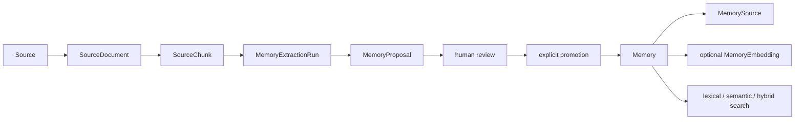

# Architecture

Second Brain is a local, Windows-hosted FastAPI application. PostgreSQL 16 with
pgvector runs in Docker Compose. Application persistence uses synchronous
SQLAlchemy 2 sessions and Alembic migrations; the current head is
`0010_agent_runtime_persistence`.

Local V1 operation is defined by `LOCAL_V1_RUNBOOK.md`, with capability evidence
in `LOCAL_V1_ACCEPTANCE.md` and explicit deferrals in `KNOWN_LIMITATIONS.md`.
The stable recovery architecture is released as `v1.0.0` at commit
`a1bf40c0a27e9ee508e9bf1ab151b4665fbdba32`. The supported release topology
remains loopback Vite and FastAPI plus the named-volume PostgreSQL service;
there is no authentication or cloud boundary. All eight top-level UI routes are
functional. Local V1.1 is published as `v1.1.0` from exact commit
`88dffa90ff04cde4c57dcacbe2764b8a31b0c9ce`; `v1.0.0` remains the pre-V1.1
recovery point.

The additive V1.1 architecture is documented in
[V1_1_ROADMAP.md](V1_1_ROADMAP.md). It preserves this topology and data model,
isolates dependency remediation and non-authoritative CI, then adds one
read-only explained-search contract and its accessible UI. Checkpoint 57 is
complete at `f6b9260`; Checkpoint 58 consumes `POST /memories/search/explained`
locally. Checkpoint 59 is committed at `42fdfc8`; Checkpoint 60 is complete at
the V1.1 release commit. Existing
search responses and version-1 export/import remain compatible. No V1.1
migration is proposed.

Checkpoint 61 completed the documentation-only Local V1.2 Agent architecture at
`850cfd0a749b5de072b910203ba9906ab5270b40`. Checkpoint 62 adds only the durable
five-table persistence foundation (`agent_runs`, `agent_steps`,
`tool_invocations`, `approval_requests`, and append-oriented `agent_events`) in
`0010_agent_runtime_persistence`; it is pending human review. Repositories accept
caller-owned synchronous sessions and never commit. AgentRun row locks serialize
revision and event-sequence allocation, and child ownership derives scope from
the Run. Version-1 Project export/import excludes these tables. The architecture is in
[V1_2_AGENT_ROADMAP.md](V1_2_AGENT_ROADMAP.md) and
[AGENT_THREAT_MODEL.md](AGENT_THREAT_MODEL.md). Checkpoint 63 is not started and
no Agent Runtime, API, UI, provider, tool, approval execution, Automation, or
external behavior exists. The proposed boundary
separates a manually initiated durable Agent Run from a future Automation that
would trigger a Run. Initial authority is read-only: models cannot grant
authority, tools are code-owned/versioned/schema-bounded, proposals require
exact immutable human review, and execute authority is unavailable. Schedulers,
workers, connectors, external writes, arbitrary execution, and remote or
multi-user operation remain outside V1.2.

The Checkpoint 56 CI workflow is an early regression signal on pull requests to
`main`, pushes to `main`, and manual dispatch. Its Windows runner performs the
established non-database Quick path and locked frontend checks without secrets,
write permission, PostgreSQL, Docker, artifacts, publishing, or deployment.
It does not replace the release-authoritative local
`.\scripts\verify.ps1 -Mode Full` workflow or its database and acceptance gates.

A client-only React and TypeScript application lives in `frontend/`. Vite serves
the local development UI and proxies `/api/*` to the existing loopback FastAPI
routes after removing `/api`. The browser uses same-origin relative requests by
default, so the backend requires no CORS changes. The initial dashboard reads
only `/health` and `/ready`. Projects uses the existing paginated list and
creation contracts plus read-only single-Project retrieval; its routes provide
list, creation, and detail screens. Sources uses paginated list and creation
contracts, read-only single-Source retrieval, and the existing Source-to-Memory
relationship listing for safe provenance detail. Source detail also lists its
persisted document, links to explicit JSON/TXT/PDF ingestion, and provides a
read-only paginated chunk browser. Proposals provides explicit SourceDocument-triggered
generation, a filtered paginated review queue, evidence/provenance detail, human
approval or rejection, and separate explicit promotion. Memories provides
persisted-field filtering and pagination, safe detail provenance, explicit
quality/supersession/expiration actions, and read-only quality advisories.
Search provides explicit lexical, semantic, and hybrid retrieval through the
additive explained-search contract, preserves backend ordering and global ranks,
and presents validated channel signals as ordering aids. Answers provides an
explicit stateless question workflow through the existing answer contract,
preserves returned citation order, and links returned public Memory IDs without
follow-up requests. Settings is a local operations dashboard over
health, readiness, safe diagnostics, aggregate maintenance findings, and
embedding coverage. It also provides explicit, loopback-only version-1 Project
export, import validation, and conflict-free import execution. Bundles stream
through exact temporary files; validation remains read-only and execution owns
one atomic commit. It exposes no repair, migration, or embedding control.
The frontend has no authentication, persistent browser storage,
service worker, or provider integration.

## Components and data

- `Project` groups Memories and proposal work.
- `Memory` is the reviewed knowledge record. `Source` and `MemorySource` provide
  normalized provenance links.
- `MemoryEmbedding` stores the optional current provider/model embedding outside
  `Memory`.
- `SourceDocument` stores TXT/PDF ingestion metadata and extracted text;
  `SourceChunk` stores ordered evidence ranges.
- `MemoryExtractionRun` records a deterministic AI extraction attempt;
  `MemoryProposal` stores immutable evidence snapshots and review state.
- Memory retrieval supports lexical PostgreSQL text search, semantic pgvector
  search, and hybrid Reciprocal Rank Fusion (RRF).
- The additive explained-search projection exposes only one-based global result
  and channel ranks, six-decimal bounded lexical/semantic signals, and hybrid
  RRF contributions with `k=60`. Ranking, filtering, fusion, ordering, and
  pagination remain in one bounded SQL statement. Lexical mode never resolves
  an embedding provider; semantic and hybrid modes preserve existing safe
  provider behavior. Queries, embeddings, results, and history are not stored.
- Evidence-backed answers are stateless, read-only operations over one bounded
  active-Memory retrieval. A strict answer provider may cite only deterministic
  evidence labels; questions, answers, prompts, and retrieval history are not
  persisted.
- Memory quality detection performs advisory, read-only exact and similar
  candidate classification within one project. It may read existing embeddings
  only when provider, model, and dimensions match, but never generates them or
  modifies a Memory. Exact equality is queried independently; advisory similar
  discovery uses bounded relevance-ranked lexical and semantic pools.
- Contradiction detection reuses those same scoped, bounded candidate pools and
  reports only deterministic English explicit-negation or opposing-boolean-state
  pairs whose remaining normalized proposition anchors match exactly. It is
  advisory, non-exhaustive, provider-free, and never persists its results.
- Memory supersession is an explicit human action between two existing active
  Memories in equal nullable project scope. It preserves provenance and content,
  supports acyclic predecessor chains, and atomically marks only the older row
  superseded while linking the active replacement. Deterministic row locking
  enforces one direct successor and idempotent concurrency without automatic
  contradiction resolution.
- Memory expiration is an explicit human action on one active Memory. A row lock
  makes the active-to-expired transition idempotent under concurrency; the
  operation preserves an existing past expiration timestamp and replaces a null
  or future timestamp with the request's captured UTC time. No scheduler changes
  status merely because `expires_at` passes.
- Memory quality refinement is an explicit human action on one active Memory.
  A row lock serializes partial or complete confidence/importance updates;
  equal requests write nothing. No provider, automatic scoring, or retrieval
  ranking policy participates.
- Batch Memory embedding generation is an explicit synchronous action over at
  most 50 active Memories that lack embeddings. Project, unassigned, and all
  scopes select deterministically by creation time and UUID. One ordered
  provider request is validated before deterministic row locks recheck status
  and existing embeddings; successful inserts commit atomically, concurrent
  winners remain unchanged, and newly inactive rows are skipped. Empty batches
  resolve no provider. Existing embeddings are never replaced, and no
  background generation or re-embedding occurs.
- Batch Memory re-embedding is a separate explicit synchronous action over at
  most 50 active Memories that already have embeddings. Stale selection compares
  the canonical input hash and configured provider, model, and dimensions;
  forced-all selection replaces every eligible in-scope row. SQL selects in
  creation-time and UUID order, one validated provider batch runs without row
  locks, and deterministic locks then recheck eligibility before atomic in-place
  replacement. Embedding identity and creation time are preserved. Missing
  embeddings are never created, and no scheduled or background re-embedding
  occurs.
- Memory maintenance auditing is a developer-only, point-in-time, read-only
  operation. It captures one UTC instant, aggregates status/project assignment,
  and reports bounded creation-time/UUID-ordered IDs for missing or stale active
  embeddings, due/future active expiration timestamps, inconsistent expired
  state, and non-active embeddings. Staleness reuses the controlled
  re-embedding SQL predicate. Parsed/live database identity and a database
  read-only transaction prevent accidental writes; no provider is resolved.
- AI generation produces proposals. Human approval and explicit promotion are
  separate actions; only promotion creates a `Memory` and `MemorySource`.
- Project export is an explicit maintainer-only, read-only operation. It streams
  one project-scoped graph from a repeatable-read PostgreSQL snapshot into the
  checksummed `second-brain-project-export` version 1 private bundle.
- Project import is an explicit maintainer-only operation. It validates a
  complete version-1 bundle and target conflicts before dependency-safe inserts
  in one transaction. Validation-only is read-only; restore never merges,
  overwrites, remaps, repairs, or calls a provider.
- Operational diagnostics are an explicit local, read-only command. One captured
  UTC instant covers runtime/configuration identity, PostgreSQL and pgvector,
  Alembic consistency, required tables, and safe aggregate counts. Provider
  configuration is inspected without resolution or network calls; optional API
  probes are restricted to credential-free loopback targets.
- `GET /operations/diagnostics` reuses the established configuration, PostgreSQL,
  pgvector, Alembic, required-table, and aggregate-count checks inside the request
  session's database-enforced read-only transaction. Its public contract removes
  the target database and all diagnostic metadata; each check exposes only its
  ID, category, status, and safe message.
- `GET /operations/maintenance-audit` reuses the established audit with a zero
  detail limit and exposes aggregate status and finding counts only. Memory UUID
  samples and truncation details remain private. The underlying audit has no
  Project-scoped contract, so the route accepts no Project filter.
- `POST /operations/project-exports/{project_id}` streams the established
  deterministic bundle as a private attachment. `POST
  /operations/project-imports/validate` and `/execute` accept bounded raw bundle
  bodies. All three require the direct loopback client and a distinct exact
  operation header, ignore forwarded-client headers, return `no-store`, and
  remove only their request-owned temporary file.

## Boundaries and transactions

Persistence models define database shape and relationships. Repositories own
SQL-side filtering, locking, ordering, ranking, and persistence operations, but
never commit. Typed FastAPI routes validate public input, map expected failures,
own commit/rollback, and shape public responses. Provider integrations isolate
paid/external embedding and extraction calls. Ingestion and extraction helpers
that parse, normalize, chunk, hash, or validate data remain pure where possible.
The caller that owns the SQLAlchemy session owns the transaction.
